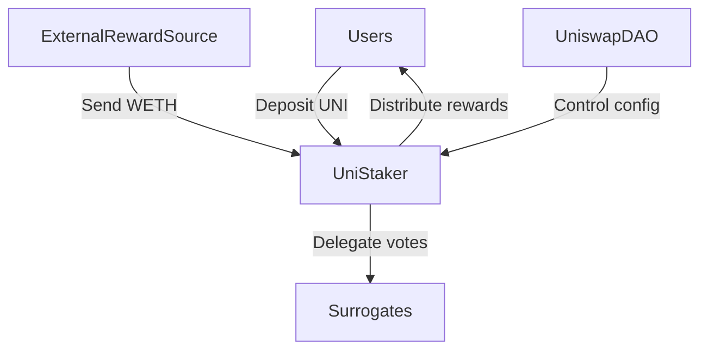

## Purpose

The UniStaker contract allows Uniswap governance token (UNI) holders to stake their tokens and earn yield rewards over time. It incentivizes long-term locking of UNI while still allowing stakeholders to retain their governance voting rights.

### Architecture



The UniStaker contract allows Uniswap governance token (UNI) holders to stake their tokens and earn WETH yield rewards over time. 

To preserve voting power, separate Delegation Surrogate contracts hold staked UNI and delegate voting power back to depositors.

**Key Contracts**

| Contract | Responsibility | Privileged Roles |
|-|-|-|
| UniStaker | Holds staked UNI<br>Distributes WETH rewards | Admin - Set reward notifiers<br>Reward notifiers - Notify rewards |  
| DelegationSurrogate | Holds UNI, delegates votes | None |

**Deposit Lifecycle**

```
1. User approves UniStaker contract
2. User calls stake() 
3. UniStaker transfers UNI to Surrogate  
4. Surrogate delegates voting power to User 
5. UniStaker begins accumulating WETH rewards for User
```

**Potential Issues**

- **Economic Attacks:** Flash loan manipulations of reward notifications or governance conditions
- **Governance Attacks:** Bribing admin to add malicious reward notifier  
- **Shortfall Attacks:** Notifiers provide insufficient rewards for rate
- **Frontrunning:** Sandwiching deposit/withdrawal transactions

**Mitigations** 

- Use Merkle proofs and commit-reveal schemes for reward notification
- Implement slashing for malicious notifier behavior 
- Fix calculate reward rate vulnerability
- Use event-ordering scheme to mitigate sandwiched transactions

## Admin abuse risks

**Administrator Privileges:**

[**UniStaker Contract:**](https://github.com/code-423n4/2024-02-uniswap-foundation/blob/main/src/UniStaker.sol)
- admin variable: stores the admin address which has elevated privileges
- `setAdmin()` function: allows the current admin to set a new admin address 
- `setRewardNotifier()` function: allows the admin to enable/disable reward notifier addresses
- notifyRewardAmount() function: can only be called by enabled reward notifier addresses

[**V3FactoryOwner Contract:**](https://github.com/code-423n4/2024-02-uniswap-foundation/blob/main/src/V3FactoryOwner.sol) 
- admin variable: stores the admin address which has elevated privileges
- `setAdmin()` function: allows the current admin to set a new admin address
- `setPayoutAmount()` function: allows the admin to update the payout amount
- `enableFeeAmount()` function: allows the admin to enable fee amounts on the factory 
- `setFeeProtocol()` function: allows the admin to set protocol fees on pools

**Vulnerability Assessment:**

**Centralization Risks:**
- The contracts have significant dependence on the admin role. A malicious or compromised admin could:
  - Change the admin to another address they control (both contracts)
  - Enable malicious reward notifier addresses that call [`notifyRewardAmount()`](https://github.com/code-423n4/2024-02-uniswap-foundation/blob/5a2761c8277541a24bc551fbd624413b384bea94/src/UniStaker.sol#L570-L599) to manipulate rewards (UniStaker)
  - Change critical protocol parameters like the `payoutAmount` (V3FactoryOwner) 
  - Enable unreasonable fee amounts on the factory (V3FactoryOwner)
  - Set unfair protocol fees on pools (V3FactoryOwner)

**Authorization Flaws:**
- The admin functions are protected by the [`_revertIfNotAdmin()`](https://github.com/code-423n4/2024-02-uniswap-foundation/blob/5a2761c8277541a24bc551fbd624413b384bea94/src/V3FactoryOwner.sol#L202-L204) modifier which checks `msg.sender` against the admin variable.
- This provides some protection but is still a single point of failure. If admin private key is compromised, so is the contract.

**Upgradeability Risks:** 
- The contracts do not appear to be upgradeable which is good. Upgradeable contracts carry more admin abuse risk.

**Lack of Transparency:**
- Most admin actions emit events which provides some transparency. 
- However, [`setRewardNotifier()`](https://github.com/code-423n4/2024-02-uniswap-foundation/blob/5a2761c8277541a24bc551fbd624413b384bea94/src/UniStaker.sol#L210-L214) in UniStaker doesn't emit an event when disabling a notifier.

**Mitigation Recommendations:**

**Multi-sig:**
- Admin actions should be put behind a multi-sig wallet instead of a single admin address.
- This decentralizes control and reduces risk of a single compromised admin.

**Timelocks:** 
- Critical admin functions should be made timelocked. For example:
  - `setAdmin()`, `setRewardNotifier()`, `setPayoutAmount()`, `enableFeeAmount()`, `setFeeProtocol()`
- A timelock requires changes to be broadcast and a delay to pass before execution, allowing users to review.

Role-Based Access Control (RBAC):
- Consider separating the admin responsibilities into multiple roles. For example:
  - A role that can set reward notifiers but not change the admin.
  - A role that can set payout amounts but not enable fee amounts.
- This limits the damage that can be done if any single role is compromised.

Enhanced Logging:
- Ensure that all admin actions emit events, even disabling actions like turning off a reward notifier.
- Consider also logging admin actions to off-chain monitoring and alerting systems.

> While the contracts have some protections around admin actions, there is still too much power concentrated in the admin role, creating significant potential for abuse. Implementing the recommended mitigations like multi-sig, timelocks, RBAC, and logging would greatly improve the security posture and reduce admin abuse risks.

**Admin Incentives**

The admin has wide privileges like setting pool fees and the payout amount. They could be bribed to configure things to:

- Minimize fees that get distributed to stakers
- Open arb opportunities for bribers to extract value
- Maximize fees sent to a specific account

For example, very high fees sent to an accomplice's address.

**Fee Claimant Incentives** 

Claimants want to maximize profit when claiming fees. They could:

- Frontrun and sandwich legitimate trades to trigger max fees
- Manipulate the AMM in ways that their arbitrage bots profit from
- Exploit flash loans and prediction markets to enhance profits

In both cases, oversight and transparency around usage of privileged roles could deter misbehavior. Auditing claimed fees for irregularities can catch exploitation.

Economic incentives should align the admin and claimants to act in good faith. But we must architecturally assume malicious incentives and protect against them.

--------------------------------------------------------------------------------------------------------------------------------------------

## Systemic risks

**External Dependencies:**

Oracles:
- The contracts do not appear to rely on any external data feeds or oracles. This is good as it reduces the risk of manipulation or downtime of external dependencies.

Other Contracts:
- The UniStaker contract interacts with the `STAKE_TOKEN` and `REWARD_TOKEN` ERC20 contracts. The security of UniStaker therefore depends on the security of these ERC20 implementations.
- The `V3FactoryOwner` contract interacts with the Uniswap V3 Factory and Pool contracts. It is highly dependent on the security and correct functioning of these complex contracts.
- Any vulnerabilities or unexpected behavior in the Uniswap contracts could potentially be exploited through the V3FactoryOwner contract.

**Composability Risks:**

_Unforeseen Interactions:_
- The UniStaker contract could potentially be integrated into other staking or rewards systems in unexpected ways. For example, another contract could potentially stake tokens on behalf of users without their explicit consent if they have approved the contract to transfer their tokens.
- The V3FactoryOwner's `claimFees` function could potentially be used in conjunction with flash loans to extract value from the system. An attacker could take out a large flash loan of `PAYOUT_TOKEN`, use it to claim fees, and then repay the loan in the same transaction, profiting from the arbitrage.

**Economic and Market Considerations:**

**Liquidity Risks:**
- The V3FactoryOwner contract's functioning depends on the liquidity of the PAYOUT_TOKEN. If the token becomes illiquid or its price becomes very volatile, it could disrupt the fee claiming mechanism.
- If the `payoutAmount` is set too high and the `PAYOUT_TOKEN` price drops significantly, it may become unprofitable to claim fees, leading to a buildup of unclaimed fees in Uniswap pools.

**Incentive Misalignment:**
- The UniStaker contract's staking and reward mechanism seems well-aligned. Users are incentivized to stake for longer to earn more rewards.
- However, in the `V3FactoryOwner` contract, the fee claim mechanism might lead to a "tragedy of the commons" scenario. Each individual is incentivized to claim fees as soon as it's profitable for them, even if this is suboptimal for the overall health and value accrual of the Uniswap protocol.

**Governance Risks:**

_Centralization:_
- Both contracts have a significant centralization risk in the form of the admin role. The admin has wide-reaching powers to change critical parameters and potentially disrupt the functioning of the contracts.
- This concentration of power in a single address is a significant systemic risk.

**Lack of Adaptability:**
- The contracts do not have any explicit mechanism for the community to modify parameters or logic. All changes are at the discretion of the admin.
- This lack of adaptability means the contracts may not be able to quickly respond to changing market conditions or newly discovered vulnerabilities.

**Mitigation Recommendations:**

_Circuit Breakers:_
- Consider implementing circuit breaker mechanisms that pause certain functions under extreme conditions. For example:
  - Pause `staking/unstaking` in `UniStaker` if `STAKE_TOKEN` or `REWARD_TOKEN` price volatility exceeds a certain threshold.
  - Pause fee claiming in `V3FactoryOwner` if `PAYOUT_TOKEN` price drops suddenly.

**Stress Testing:**
- Conduct thorough stress tests simulating extreme market conditions, flash loan attacks, and other unexpected scenarios.
- Use these simulations to identify and fix potential breaking points in the system.

**Formal Verification:**
- Given the complexity of the V3FactoryOwner contract's interactions with Uniswap, consider using formal verification to prove the correctness of the contract's logic under all possible interaction scenarios.

**Decentralized Governance:**
- Implement a decentralized governance mechanism, such as a DAO, to manage the admin functions of the contracts.
- This could help mitigate centralization risks and make the system more adaptable to change.

In terms of ecosystem-level risks, the health of these contracts is heavily tied to the health of the Uniswap protocol and the broader DeFi ecosystem. Any significant failures or exploits in major DeFi protocols could have cascading effects. Regularly monitor the ecosystem for emerging risks and be prepared to adapt quickly.

As for "black swan" events, some possibilities to consider:
- A major stablecoin used in Uniswap pools becomes unpegged, leading to extreme price volatility and liquidity issues.
- A critical vulnerability is discovered in the Uniswap V3 core contracts, requiring an emergency response.
- Regulatory action against major DeFi players causes a market-wide panic and sell-off.

> While the contracts seem well-designed in isolation, there are significant systemic risks arising from their external dependencies, composability, economic factors, and governance centralization. Implementing the suggested mitigations and staying vigilant to ecosystem-level risks will be crucial for long-term resilience.

--------------------------------------------------------------------------------------------------------------------------------------------

## Potential vulnerabilities, inefficiencies, and deviations from best practices

**Common Exploits:**
- No obvious reentrancy vulnerabilities found. The contracts avoid state changes after external calls.
- No unchecked arithmetic operations found. The contracts use SafeMath for arithmetic operations to prevent integer overflows/underflows.
- No usage of `block.timestamp` or now for critical functionality, reducing the risk of timestamp manipulation.
- Functions that change state are protected from front-running by requiring signatures or being callable only by specific roles.

**Logic Errors:**
- In `UniStaker`, the `_checkpointReward` function assumes that the global `rewardPerTokenCheckpoint` has already been updated. If this function is called without first calling `_checkpointGlobalReward`, it could lead to incorrect reward calculations.
- In V3FactoryOwner, the `claimFees` function does not check if the caller has approved the contract to transfer `PAYOUT_TOKEN` on their behalf. This could lead to a situation where the transaction fails due to lack of allowance, even though the caller might expect it to succeed.

**Access Control:**
- Most privileged functions are appropriately restricted to the admin role using the `_revertIfNotAdmin` modifier.
- However, the `setAdmin` function in both contracts allows the current admin to unilaterally change the admin address without any time-delay or additional checks. This could be problematic if the admin key is compromised.

**Code Optimization:**

_Gas Inefficiencies:_
- In UniStaker, the `_stake` and `_stakeMore` functions could be refactored to avoid the repeated calls to `_checkpointGlobalReward` and `_checkpointReward`. These could be called once at the beginning of the function.
- In V3FactoryOwner, the `claimFees` function could use `msg.sender` directly instead of passing it as a parameter to the `FeesClaimed` event, saving some gas.

**Redundancies:**
- The `_revertIfNotAdmin` modifier is identical in both contracts. Consider moving it to a shared library to avoid duplication.
- The error messages in `UniStaker` (e.g., `UniStaker__Unauthorized`, `UniStaker__InvalidAddress`) are repeated. These could be defined as constants to save gas and improve readability.

**Best Practices and Standards:**

**ERC Compliance:**
- The contracts do not aim to be ERC compliant as they are not standard token contracts.

**Coding Conventions:**
- The contracts follow a consistent naming convention for variables, functions, and events, which improves readability.
- Most functions have clear and detailed NatSpec comments explaining their purpose and parameters.
- Consider adding more comments for complex pieces of logic, like the reward calculation in UniStaker.

**Test Coverage:**
These contracts were built and tested with care by the team at [ScopeLift](https://scopelift.co/).

**Build and test**

This project uses [Foundry](https://github.com/foundry-rs/foundry). Follow [these instructions](https://github.com/foundry-rs/foundry#installation) to install it.

Clone the repo.

Set up your .env file

```
cp .env.template .env
# edit the .env to fill in values
```
Install dependencies & run tests.

```
forge install
forge build
forge test
```
**Spec and lint**

This project uses [scopelint](https://github.com/ScopeLift/scopelint) for linting and spec generation. Follow [these instructions](https://github.com/ScopeLift/scopelint?tab=readme-ov-file#installation) to install it.

To use scopelint's linting functionality, run:

```
scopelint check # check formatting
scopelint fmt # apply formatting changes
```

To use scopelint's spec generation functionality, run:

```
scopelint spec
```

This command will use the names of the contract's unit tests to generate a human readable spec. It will list each contract, its constituent functions, and the human readable description of functionality each unit test aims to assert.

**Mitigation Recommendations:**

- For the potential logic error in UniStaker, ensure that `_checkpointGlobalReward` is always called before `_checkpointReward`.
- For the potential issue in V3FactoryOwner's `claimFees`, consider checking the caller's allowance and reverting if it's insufficient.
- For the admin change functionality, consider implementing a two-step process where the current admin nominates a new admin, and the new admin needs to accept the role. This could be combined with a time-lock to give users time to react to potential malicious admin changes.
- Refactor the `_stake` and `_stakeMore` functions in UniStaker to call `_checkpointGlobalReward` and `_checkpointReward` only once at the beginning.
- Use `msg.sender` directly in V3FactoryOwner's `claimFees` function instead of passing it as a parameter to the event.
- Move the `_revertIfNotAdmin` modifier to a shared library to avoid duplication across contracts.
- Define error messages as constants in UniStaker to save gas and improve readability.
- Ensure a comprehensive test suite is developed to cover all main functionalities and potential edge cases.

**Additional Considerations:**

- Prioritize readability and simplicity in the code. Complex optimizations can sometimes introduce new risks.

> The provided contracts appear to be well-structured and follow many best practices. However, there are a few potential issues related to logic, access control, and gas optimization that should be addressed. Implementing the suggested mitigations and ensuring thorough test coverage would further improve the security and reliability of the codebase.

----------------------------------------------------------------------------------------------------------------------------------------

## Potential risks arising from its interactions with external systems

**Uniswap V3 Pools**

- Manipulation of V3 pool parameters or oracles to skew valuations before claiming fees. This could enable profitable fee extraction at the contract's expense.

- Flash loan attacks using V3 pools to manipulate UniStaker conditions, extract rewards, then arbitrage profits back through the V3 pool.

**Uniswap Governance**

- Bribery attacks to get a malicious reward notifier contract approved by DAO governance, which then griefs actual reward distribution.

- Governance proposals to change parameters like WETH reward token allocation, affecting staker APY and contract conditions.

**DeFi Protocols** 

- Sandwich attacks by monitoring mempool and identifying UniStaker deposit transactions to frontrun and profit from slippage.

- Oracle manipulation on assets like WETH that are used for pricing and reward calculations. Could skew profits.

**User Wallets**

- Meta-transactions via smart contract wallets can obscure actual token sources. Flash loaned and borrowed tokens could be used for attacks.

The contract's privileges, integrations, token interactions, and incentive designs create a large surface area for risks from external sources. Rigorous analysis is required to make the system robust.

### Key mathematical operations that involve token balances, reward calculations, stake tracking, and time-related variables

**Token Balances**

*   `totalStaked += _amount` (stake deposit)
*   `depositorTotalStaked[_depositor] += _amount` (per-depositor stake tracking) 
*   `deposit.balance += _amount` (per-deposit stake tracking)
*   `totalStaked -= _amount` (stake withdrawal)
*   `depositorTotalStaked[_depositor] -= _amount` (per-depositor stake tracking)
*   `deposit.balance -= _amount` (per-deposit stake tracking)

**Reward Calculations**  

*   `scaledRewardRate * (lastTimeRewardDistributed() - lastCheckpointTime)` (accumulate interim rewards)
*   `scaledRewardRate * REWARD_DURATION` (validate reward balance suffiency) 
*   `_remainingReward + _amount * SCALE_FACTOR` (calculate new reward rate)
*   `earningPower[_beneficiary] * (rewardPerTokenAccumulated() - beneficiaryRewardPerTokenCheckpoint[_beneficiary])` (calculate unclaimed rewards)

**Stake Tracking**

*   `earningPower[_beneficiary] += _amount` (track rewards per beneficiary)
*   `earningPower[_beneficiary] -= _amount` (track rewards per beneficiary)

**Time Variables**

*   `lastTimeRewardDistributed() - lastCheckpointTime` (accumulate interim rewards)
*   `scaledRewardRate * (rewardEndTime - block.timestamp)` (remaining rewards)
*   `block.timestamp + REWARD_DURATION` (set new reward end time)

### Some safeguards in place, but additional checks could be beneficial to prevent potential overflow, underflow or wrapping issues:

**Existing Safeguards**

- Usage of OpenZeppelin's SafeERC20 library for token transfers - helps prevent issues like transfers failing or transferring incorrect amounts.

- Revert on invalid reward rate being 0 in `notifyRewardAmount`. Helps avoid math issues.

- Revert on insufficient reward balance after notification in `notifyRewardAmount`. Provides a sanity check.

**Potential Issues**

- No explicit safeguards against overflows/underflows in the mathematical operations themselves. Extremely large or small values could theoretically cause wraparound.

- The per-deposit `balance` variable tracking stake amount is a uint256. In practice this is likely fine, but huge values could cause overflow.

- Scaling amounts by 1e36 in some reward calculations could exponentiate overflows.

- No validation that `lastCheckpointTime` is reasonable or that `rewardEndTime` doesn't exceed some max reasonable time.

**Recommendations**

- Use OpenZeppelin's SafeMath library for overflow checked math.

- Set upper bounds for values like deposit balances, timestamps, and staked totals.

- Add require statements validating inputs and values are in expected ranges before math.

- Consider SafeCast library to prevent value wraparound.

- Fuzz test with extreme values during auditing.

Adding some extra defensive checks would help prevent unexpected issues!

### Rounding logic

**Rounding and Precision**

- The main rounding risk is in the reward calculation math, since it involves division operations.

- `UniStaker` mitigates this by using a `SCALE_FACTOR` of 1e36 to add precision. This helps reduce rounding errors. 

- However, truncation still happens when dividing by `SCALE_FACTOR` to get back to normal value.

- Small remainders could favor attackers over time.

**Recommendations**

- Consider always rounding up when dividing scaled amounts by `SCALE_FACTOR`. This would favor the protocol's reserves.

- Apply a check that when dividing by `SCALE_FACTOR`, the remainder is less than some small threshold like 1. If above, round up.

- Invariants could explicitly track remainders and assert the sum tends towards the protocol over time.

- Fuzz testing could help identify edge cases. 

###  scenarios related to interactions with specific Uniswap V3 pools that could lead to unexpected behavior or vulnerabilities in the UniStaker infrastructure

**Extreme price moves in a pool**

- If prices in a fee-earning pool make a extreme move, it could make claiming fees very profitable. This could incentivize manipulating the pool price or trading patterns to maximize profits when claiming fees.

**Low liquidity pools** 

- If a fee-earning pool has very low liquidity, a few large trades could again make claiming fees very profitable by substantially changing the value of fees owed. This incentivizes targeting low liquidity pools.

**Pools with high swap fees**

- If a pool has high swap fees, the protocol fees accrue more quickly. This could make claiming profitable more frequently than expected.

**Asset pricing outliers**

- If the price of assets in a fee-earning pool diverge from the broader market, it could make arbitraging the fees through the payout token more profitable. This could incentivize targeting pools with potential asset pricing differences.

**Manipulating trading patterns** 

- Traders could attempt to manipulate typical trading patterns in a pool once they know it is fee-earning. This could make claiming fees more profitable.

**Frontrunning**

- Bots could attempt to frontrun calls to claim fees if they see an opportunity for profit.

**Changing pool parameters**

- If pool parameters like swap fees are changed after being made fee-earning, it could have unintended effects.

Overall, profit motives around claiming fees could incentivize malicious actors to manipulate conditions in fee-earning pools or trade against them in unexpected ways. The contracts should be resilient to these scenarios.

### Time spent:
42 hours