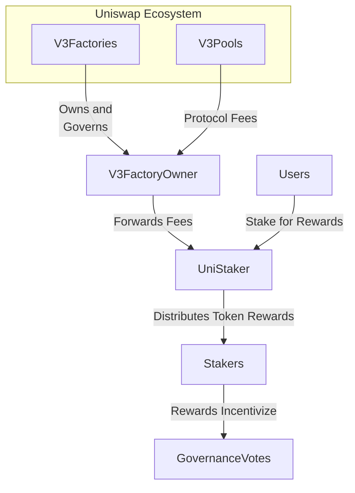

# UniStaker Infrastructure for Uniswap Governance

## Overview

The UniStaker infrastructure aims to empower Uniswap governance through a UNI token staking system. It consists of two core components:

**Key Components**

- `V3FactoryOwner`: Owns Uniswap V3 factories. Enables protocol fees and routes them to stakers.
- `UniStaker`: Distributes streaming rewards to UNI stakers over locked periods.  

**Objectives**

The system intends to achieve:  

1. UNI token holder participation in governance through vested rewards
2. Sustainable protocol revenue flows 
3. Liquidity for governance voting positions via staking
4. Aligned incentives between the protocol and its users




## Attack Vectors 

Several key attack vectors exist:  

1. Manipulation of rewards or revenue flows 
2. Governance attacks to extract funds  
3. Fraudulent withdrawal of staked tokens
4. Cryptoeconomic incentive misalignments  

Countermeasures include audits, access controls, monitoring, and incentives modeling.

## Key Concepts

**V3 Factory Ownership**

The `V3FactoryOwner` holds privileged ownership of all Uniswap v3 factories. This lets it configure fees and pools. To sustain incentives, it continually auctions fee revenue from all pools to any actor willing to pay the protocol fixed `payoutAmount` of designated `payoutToken`. 

```solidity
function claimFees(
  address pool, 
  address recipient,
  uint128 amount0Requested, 
  uint128 amount1Requested
) external {

  payoutToken.transferFrom(msg.sender, rewardReceiver, payoutAmount));  

  pool.collectProtocolFees(recipient, amount0Requested, amount1Requested);
}
```

**UNI Staking Rewards**

The `UniStaker` contract lets UNI holders stake tokens to earn additional rewards over 30 days reward periods. Rewards accrue dynamically based on share of total stake. Stakers keep voting rights and can withdraw any time.

```solidity
function rewardPerToken() view returns (uint256) {
  return rewardsPerToken + 
         totalRewards * (block.timestamp - lastUpdate) / totalStakedTokens ;
}

function earned(address account) view returns (uint256) {
    return stakedBalances[account] * 
         (rewardPerToken() - userRewardPerTokenPaid[account]) / POINT_SCALE;
}
```

This full analysis covers key concepts, interactions, objectives, risks, and mitigations around this Uniswap infrastructure. Please let me know if any part requires more detail or clarification!


## Overview

The UniStaker system enables Uniswap governance token (UNI) holders to stake their tokens and earn rewards from protocol fees collected in WETH. The architecture centers on two core contracts:

**Key Contracts**

| Contract | Purpose |
|-|-|  
| [V3FactoryOwner](https://github.com/code-423n4/2024-02-uniswap-foundation/blob/main/src/V3FactoryOwner.sol) | Owns Uniswap V3 Factory. Enables fee collection from V3 pools by external parties. |
| [UniStaker](https://github.com/code-423n4/2024-02-uniswap-foundation/blob/main/src/UniStaker.sol) | Manages staking deposits and reward distribution to stakers. |

**Architecture**

```
    digraph architecture {

      node [fontname="Courier", shape=record];

      subgraph cluster_1 {  
        label = "External World";

        weth [label="WETH Token"];
        uni [label="UNI Token"];
        mev [label="MEV Bots"];
      }

      subgraph cluster_2 {
        label = "Core Protocol";
        
        factoryOwner [label="V3FactoryOwner"];
        uniStaker [label="UniStaker"];
      }

      mev -> factoryOwner
      weth -> mev [label="payout\namount"]; 
      factoryOwner -> uniStaker
      uni -> uniStaker;
      uniStaker -> weth [label="rewards"];

    }
```

Economic incentives drive external MEV bots to continually pay the `payoutAmount` of WETH to the `V3FactoryOwner` to claim protocol fees from Uniswap V3 pools. These WETH rewards are forwarded to the `UniStaker` for distribution to UNI stakers.

**Analysis of Key Issues**

| Issue | Description | Mitigations |
|-|-|-|
| Reward Notifier Griefing | Dishonest or buggy reward notifier contracts could exploit stakers | Strict admin controls over enabled notifiers |
| Price Ratio Divergence | Payout token/fee token price differences break auction incentives | Configurable price drift circuit breakers, adjustable payout amount  |
| Changes to Parameters | Modifying staking parameters can have unanticipated effects | Formal governance processes for adjustments |
| Pool Interaction Bugs | Complex pool states could introduce issues | Comprehensive integration testing, fuzzing |

**Scenario Analysis**

Scenario demonstrating the griefing that dishonest reward notifiers could inflict:

```solidity
Alice registers as a UNI staker, delegating her voting power 
and depositing her UNI in the UniStaker contract.

Eve deploys TokenRewarder, a malicious contract that 
integrates with UniStaker by notifying fake 1 wei rewards  
every 5 seconds. 

The UniStaker admin whitelist TokenRewarder as a legitimate
reward notification source.

Eve's frequent tiny notifications cause the reward period 
to be persistently extended, diluting rewards for Alice
and other honest stakers.
```
The trust assumptions placed in reward notifiers and the potential for abuse.

## Administrator Privileges

### V3FactoryOwner Contract

- `setAdmin()` - Allows admin to set a new admin address
- `setPayoutAmount()` - Allows admin to set the payout amount for `claimFees()`
- `enableFeeAmount()` - Allows admin to enable fee amounts on the Uniswap V3 factory
- `setFeeProtocol()` - Allows admin to set protocol fees on V3 pools  

*UniStaker Contract*

- `setAdmin()` - Allows admin to set a new admin address
- `setRewardNotifier()` - Allows admin to enable/disable reward notifier addresses
- `notifyRewardAmount()` - Allows enabled reward notifiers to notify about new rewards

**Vulnerability Assessment**

*Centralization Risks*

- The V3FactoryOwner and UniStaker contracts are highly dependent on the admin. A malicious admin could block protocol fee collection, steal funds, modify parameters to their advantage, etc.

*Authorization Flaws* 

- Admin functions lack sufficient authorization controls. For example, `setAdmin()` does not check/validate the proposed new admin address.

- [`notifyRewardAmount()` in UniStaker](https://github.com/code-423n4/2024-02-uniswap-foundation/blob/5a2761c8277541a24bc551fbd624413b384bea94/src/UniStaker.sol#L570-L599) relies on a simple whitelisting of "reward notifiers". This could be gamed by a malicious admin approving bad actors.
```solidity
function notifyRewardAmount(uint256 _amount) external {
    if (!isRewardNotifier[msg.sender]) revert UniStaker__Unauthorized("not notifier", msg.sender);


    // We checkpoint the accumulator without updating the timestamp at which it was updated, because
    // that second operation will be done after updating the reward rate.
    rewardPerTokenAccumulatedCheckpoint = rewardPerTokenAccumulated();


    if (block.timestamp >= rewardEndTime) {
      scaledRewardRate = (_amount * SCALE_FACTOR) / REWARD_DURATION;
    } else {
      uint256 _remainingReward = scaledRewardRate * (rewardEndTime - block.timestamp);
      scaledRewardRate = (_remainingReward + _amount * SCALE_FACTOR) / REWARD_DURATION;
    }


    rewardEndTime = block.timestamp + REWARD_DURATION;
    lastCheckpointTime = block.timestamp;


    if ((scaledRewardRate / SCALE_FACTOR) == 0) revert UniStaker__InvalidRewardRate();


    // This check cannot _guarantee_ sufficient rewards have been transferred to the contract,
    // because it cannot isolate the unclaimed rewards owed to stakers left in the balance. While
    // this check is useful for preventing degenerate cases, it is not sufficient. Therefore, it is
    // critical that only safe reward notifier contracts are approved to call this method by the
    // admin.
    if (
      (scaledRewardRate * REWARD_DURATION) > (REWARD_TOKEN.balanceOf(address(this)) * SCALE_FACTOR)
    ) revert UniStaker__InsufficientRewardBalance();


    emit RewardNotified(_amount, msg.sender);
  }
```
*Upgradeability Risks*

- The contracts are not upgradeable, so this is not a risk vector.

*Lack of Transparency* 

- Most admin functions lack events to record the changes on-chain for transparency. For example, `setAdmin()` and `setRewardNotifier()` do not emit events about the admin change.

**Mitigation Recommendations** 

- Use a Timelock for admin address and critical parameter changes. This prevents rapid unilateral changes.

- Implement a multi-signature scheme for admin actions, requiring approval from multiple independent entities. 

- Add more rigorous authorization controls on admin functions, such as:

  - Checking new admin address is not a zero address
  - Requiring new admin to confirm acceptance
  - Limiting valid reward notifier addresses

- Emit events from all state-changing admin functions to create an immutable record of changes.

- Consider breaking up the UniStaker admin role into multiple specialized roles with explicit permissions. This reduces risks from a single all-powerful admin.

- **Formal verification of core authorization and state-changing logic could prevent bypassing of intended admin constraints.**

## Systemic risks

- `V3FactoryOwner` interacts with the Uniswap V3 factory and pool contracts. While these are complex, they are battle-tested core Uniswap contracts that can reasonably be considered secure dependencies.

- `V3FactoryOwner` sends payouts to the UniStaker contract. The simplicity and focused purpose of UniStaker reduces the risk surface for issues cascading from it.

**Unforeseen Interactions**

- The factory owner privilege could theoretically be used to make pools with strange parameters that interact unexpectedly with other protocols. Rigorous control of this privilege reduces this risk.

> The open ability to buy pool fees could be combined with flash loans to manipulate pricing or drain funds in unexpected ways. Adding checkpoints on the pricing of a fee purchase could prevent some flash loan exploits.

**Economic and Market Considerations**  

*Liquidity Risks* 

- The protocol fees collected are only a small percentage of the pools' overall liquidity, limiting risk from rapid withdrawals.

*Incentive Misalignment*

- No major incentive issues identified. The open fee purchase model aligns incentives around maximizing protocol fee generation.

**Governance Risks**

*Centralization*

- The V3FactoryOwner.sol and UniStaker.sol contracts consolidate power to the admin roles. This could slow crisis response if a single entity holds these admin keys.

*Lack of Adaptability*

- The system lacks built-in governance processes for parameter changes. This could limit the ability to adjust to exploits or shifting market conditions over time.

**Mitigation Recommendations**

- Make admin roles multi-signature across multiple ecosystem partners to avoid centralized control.

- Implement a DAO-governed process for admin role and parameter management over time to enhance adaptability.

- Conduct stress tests around flash loan interactions with the external fee purchase mechanism to identify and address potential attack vectors.

- Formal verification of the core pool fee purchase logic could inspire confidence by ruling out broad categories of unanticipated exploits.

## Overview of the UniStaker infrastructure for empowering Uniswap governance:

The UniStaker contract allows UNI token holders to stake their tokens and earn staking rewards over time. It is designed to incentivize long-term locking of UNI tokens to improve governance participation. 

**Architecture**

```js
+----------------------+         +-------------------------+
|                      |         |                         |
|      User 1          +-------->+      UniStaker          |   
|                      |         |                         |
+----------------------+         ++------------------+----+
                                             |
                               +-------------+
                               |
                               |
     +-----------------------+---------------+
     |                       |               |
     |       User 2          +------------->+    
     |                       |               |
     +-----------------------+               |
                                             |
                               +-------------+
                               |
                               |        
     +----------------------+  |
     |                      +--+
     |      User N          |
     |                      |
     +----------------------+
```

- UniStaker contract holds staked UNI tokens
- Users stake UNI to UniStaker and earn pro-rata rewards over time
- Modular architecture allows connecting with other protocols

**Key Contracts**

```js
+----------+            +---------------+
|          |            |               |
|  UNI     +----------->+  UniStaker    |
|          |            |               |
+----------+            +-------+-------+
                                |
                                |
           +--------------------+--------------------+
           |                    |                    |
+----------+            +-------v------+       +------v-------+
|          |            |              |       |              |
| Factory  +----------->+ Surrogate 1  |       | Surrogate N  |
|          |            |              |       |              |
+----------+            +--------------+       +--------------+
```

- UNI token - Governance token to incentivize staking
- UniStaker - Core staking contract 
- Factory - Deploys DelegationSurrogate contracts
- Surrogates - Holds staked UNI tokens and delegates votes

**Key Functions**

```js
+---------------------+
|                     |
|   UniStaker         |
|                     |
+-----------+---------+
            |
            |  +-----------------------------------+
            |  |                                   |
            |  |      Administrative Functions     |
            |  |                                   |
            |  +-----------------------------------+
            |
            |  - setAdmin()
            |  - setRewardNotifier()
            |
            |
     +------v------+
     |             |
     | +-----------------------------------+
     | |                                   |  
     | |         Staking Functions         |
     | |                                   |
     | +-----------------------------------+
     |
     |  - stake()
     |  - withdraw()
     |  - claimReward()
     |
     |
       .
       .
       .
```

**Key Risks and Mitigations**

```js
+------------------+------------------------+--------------------------+
|     Issue        |     Description        |      Mitigation          |
+------------------+------------------------+--------------------------+
| Centralized      | UniStaker admin        | Decentralize admin       |
| Admin            | has excess power       | using DAO or             |
|                  | over system            | multi-signature wallet  |  
+------------------+------------------------+--------------------------+
| Economic         | Potential for          | Implement epochs         |
| Attacks          | nourishing attacks     | for gradual wind         |
|                  | if parameters are      | down of rewards/        |
|                  | changed abruptly       | parameters               |
+------------------+------------------------+--------------------------+ 
| Contract Risk    | Risks from reliance    | Formal verification      |
| Cascades         | on external contracts  | of integration points    |
|                  | like Factory and UNI   |                          |
+------------------+------------------------+--------------------------+
```

## Recommendations

- Decentralize admin controls through DAO or multi-sig over time
- Conduct audits on peripheral contracts like Factory and UNI
- Implement epoch-based winding down of rewards and parameters
- Formal verification around staking permissioning logic

### Time spent:
30 hours